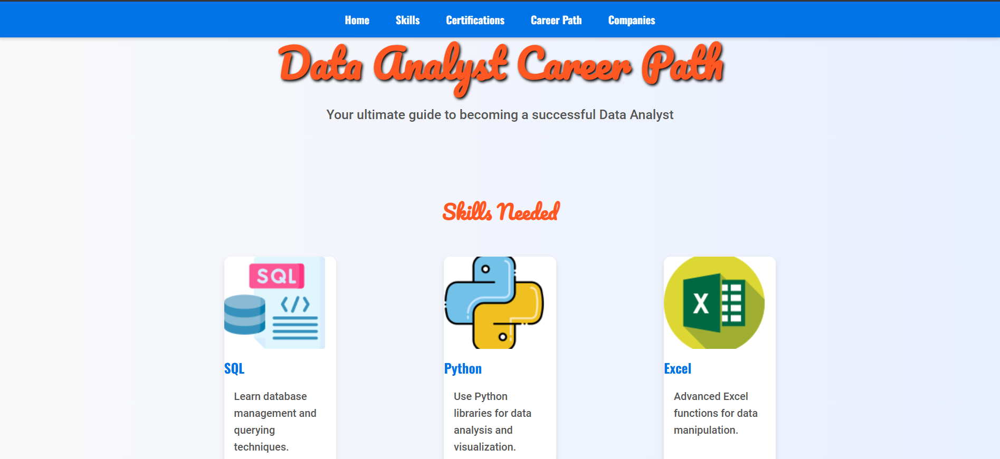
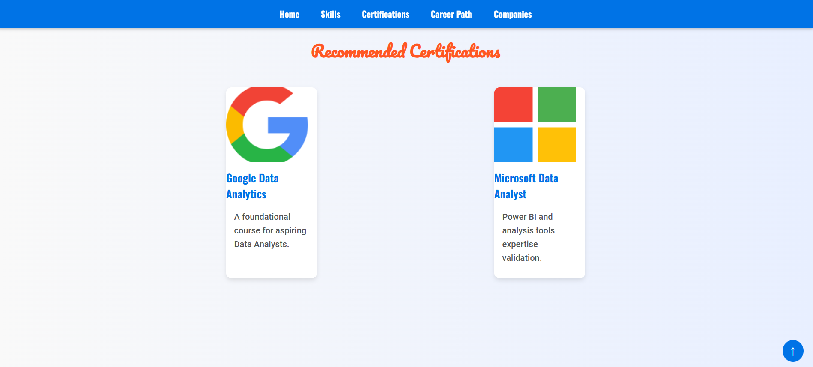
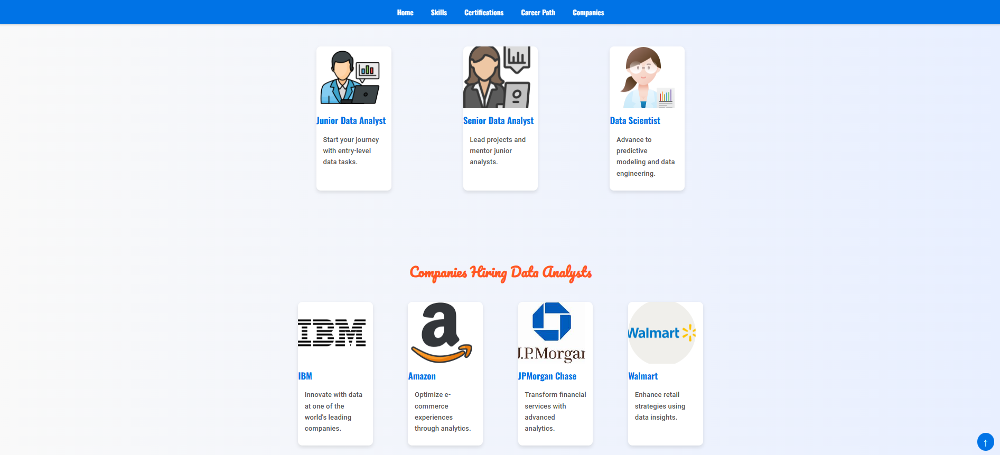

# 📊 **Data Analyst Career Path Guide** 🚀

## 📝 **Overview**

Welcome to the **Data Analyst Career Path Guide**! This project is designed for individuals interested in becoming Data Analysts. It provides a comprehensive and easy-to-understand overview of the skills needed, certifications to pursue, potential career paths, and top companies hiring Data Analysts. The guide is structured into various sections, designed with a clean and engaging layout, to provide valuable resources for anyone looking to enter the field of data analysis.

## 🔑 **Features**

- **Skills Needed** 📚:  
    - Learn the essential skills required for Data Analysts such as **SQL**, **Python**, and **Excel**.
  
- **Recommended Certifications** 🎓:  
    - Get insights into top certifications like **Google Data Analytics** and **Microsoft Data Analyst** that can boost your career.

- **Career Path** 🏁:  
    - A clear roadmap that guides you from **Junior Data Analyst** to **Data Scientist**.

- **Companies Hiring** 🏢:  
    - Find top companies like **IBM**, **Amazon**, and **Walmart** actively hiring Data Analysts.

- **User-Friendly Interface** 💻:  
    - Built using **HTML**, **CSS**, and **JavaScript** to ensure a responsive and visually appealing design.

## 💻 **Technologies Used**

- **HTML**: Markup language used to structure the webpage.
- **CSS**: Styling language to make the site clean, visually appealing, and responsive.
- **JavaScript**: Adds interactive functionality, such as smooth scrolling and a scroll-to-top button.

## 📦 **Installation**

To run this project locally:

1. Clone this repository to your local machine:

    ```bash
    git clone https://github.com/yourusername/data-analyst-career-path.git
    ```

2. Navigate into the project folder:

    ```bash
    cd data-analyst-career-path
    ```

3. Open the `index.html` file in your browser to view the project.

---

## 🤝 **Contributing**

We welcome contributions! If you'd like to contribute to this project, feel free to fork the repository and submit a pull request with your changes. Whether it's a bug fix, new feature, or improvement, we encourage you to get involved!

---

## 🖼 **Screenshots & Images**

Here are some visuals from the project that showcase the different sections of the guide:

  
*Above: Key Skills for Data Analysts*

  
*Above: Career progression for Data Analysts*

  
*Above: Top companies hiring Data Analysts*

---

## 📄 **License**

This project is licensed under the MIT License - see the [LICENSE](LICENSE) file for details.
